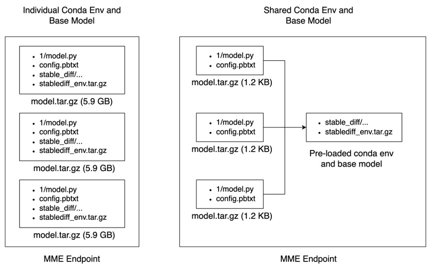
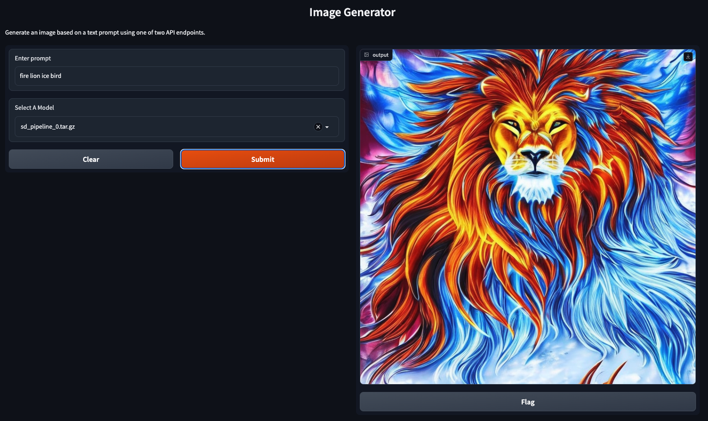

## Hyper-Personalized Stable Diffusion using MME

### Stable Diffusion models
Stable Diffusion is a deep learning, text-to-image model. It is primarily used to generate detailed images conditioned on text descriptions, though it can also be applied to other tasks such as inpainting, outpainting, and generating image-to-image translations guided by a text prompt.


### SageMaker Multi-Model Endpoint (MME)

SageMaker MME is a service provided by Amazon SageMaker that allows multiple machine learning models to be hosted on a single endpoint. This means that multiple models can be deployed and managed together, making it easier to scale and maintain machine learning applications. With a multi-model endpoint, different models can be selected based on specific needs, allowing for more flexibility and efficiency. It also enables different types of models to be combined, such as computer vision and natural language processing models, to create more comprehensive applications.

### Sharing Common Components



### Run example notebooks

`std_on_mme_byoc.ipynb` will locally build a custom docker image and host triton server for testing. It is recommended to run this example outside of SageMaker Studio

`std_on_mme_server_util.ipynb` uses an utility model with Triton Python Backend to pre-load Conda env and Stable Diffusion base model on to SageMaker MME. The utility model needs to be invoked first, this allows the actual model to read from a common location and significantly reduce the cold start time.


### Run the Interactive UI



To run the interactive ui client, you need to first install `requirements.txt`

```
pip install -r requirements.txt
```
Then run the `gradio_sd.py` file like this:

```
python gradio_sd.py

```