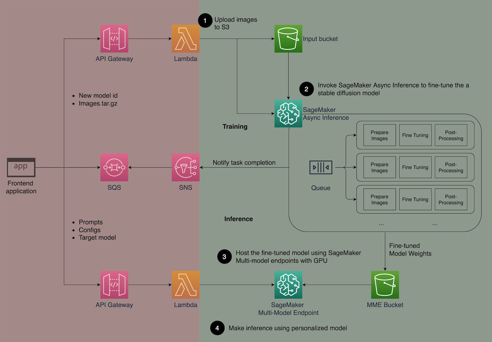
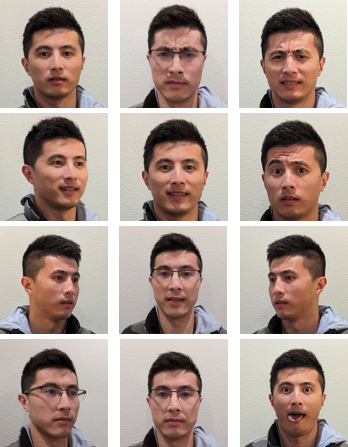
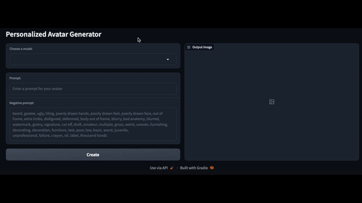

## Building Personalized Avatar With Generative AI Using Amazon SageMaker

This repo demonstrate how to use generative AI models like Stable Diffusion (SD) to build a personalized avatar solution on [Amazon SageMaker](https://docs.aws.amazon.com/sagemaker/latest/dg/whatis.html) and save inference cost with [Multi Model Endpoints](https://docs.aws.amazon.com/sagemaker/latest/dg/multi-model-endpoints.html) at the same time. You can upload 10-12 images of yourself, then fine-tune a personalized model to generate avatars based on any text prompt. While this example generates personalized avatars, you can apply the technique to any creative art generation. Please share your creations with us after you finish using hashtag #sagemaker #mme on social platforms. We would love to see what you make.

## Solution Architecture



The architecture diagram above outlines the end-to-end solution. This sample focuses only on the model training and inference orchestration (green section). Users can reference the full solution architecture and build on top of the example we provide. 

The orchestration can be broken down into four steps:

1. Upload images to S3

2. Fine-tune a Stable Diffusion (SD) 2.1 base model using SageMaker Async Inference

3. Host the fine-tuned models using SageMaker MMEs with GPU.

4. Use the fine-tuned model for inference.

## Usage
Make sure that your AWS identity has the requisite permissions which includes ability to create SageMaker Resources (Model, EndpointConfigs, Endpoints, and Training Jobs) in addition to S3 access to upload model artifacts. Alternatively, you can attach the [AmazonSageMakerFullAccess](https://docs.aws.amazon.com/sagemaker/latest/dg/security-iam-awsmanpol.html#security-iam-awsmanpol-AmazonSageMakerFullAccess) managed policy to your IAM User or Role.

Clone this repo into a Jupyter environment and run [personalized_avatar_solution.ipynb](personalized_avatar_solution.ipynb) notebook. It will take you through the each of the step mentioned above.

This notebook is tested on **PyTorch 2.0.0 Python 3.10 GPU Optimized kernel on SageMaker Studio. An GPU instance such as ml.g4dn.xlarge is recommended.**

## Additional Modules and Utilities
Additional modules and utilities are provided within subdirectories.

```
|-- models
|   └── model_setup         A Triton Python backend model that prepares the common stable diffusion components on hosting container
|       |-- 1
|       |   └── model.py
|       └── config.pbtxt
|-- training_service        Training code directory to spin up a fine tuning job in a Deep Jave Library (DJL) container
|   |--model.py
|   |--serving.properties
|   |--requirements.txt
|   |--trainer.py
|   |--train_dreambooth.py
|   |--utils.py
    └── sd_lora             A Triton Python backend model template directory for LoRA fine-tuned Stable Diffusion models
        |-- 1
        |   └── model.py
        └── config.pbtxt
```

## Example Inputs

To achieve the best results from fine-tuning Stable Diffusion to generate images of yourself, it is typically need a large quantity and variety of photos of yourself from different angles, with different expressions, and in different backgrounds.


## Example Outputs

You can try the fine-tuned model by invoking the MME endpoint at the end of the notebook. The input parameters we exposed in our example include prompt, negative_prompt, and gen_args as shown in the code snippet below. You set the data type and shape of each input item in the dictionary and convert them into json string.  Finally, the string payload and TargetModel are passed into request to generate your avatar picture. See the output example below.

Input Images          |  Personalized Output
:-------------------------:|:-------------------------:
  |  

## Security

See [CONTRIBUTING](CONTRIBUTING.md#security-issue-notifications) for more information.

## License

This library is licensed under the MIT-0 License. See the LICENSE file.